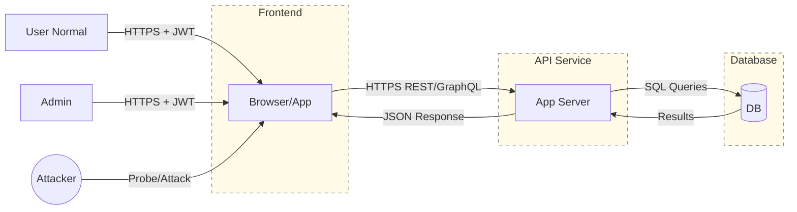

# Threat Model v1 — Hari 4 (Week 1)

## 1. Aktor

* **User normal** → hanya boleh mengakses data miliknya sendiri (CRUD terbatas).
* **Admin** → memiliki hak lebih luas (kelola user, audit, konfigurasi).
* **Attacker** → pihak luar yang mencoba akses tanpa izin (data theft, replay, IDOR, brute force).

---

## 2. Aset

* **Data user** → profil, PII, transaksi; berdampak tinggi jika bocor.
* **Token JWT** → access/refresh token untuk autentikasi dan otorisasi.
* **Kredensial Database** → connection string, akun service, password; sangat sensitif.

---

## 3. Trust Boundary

* **Frontend ↔ API** → komunikasi user (via browser/app) dengan server API.
* **API ↔ Database** → komunikasi internal API dengan DB.
* **Internet ↔ Frontend** → interaksi publik yang berpotensi diserang.

---

## 4. Ancaman & Mitigasi

1. **Sniffing traffic tanpa TLS**

   * Risiko: data disadap saat transit.
   * Dampak: kebocoran kredensial/token.
   * **Mitigasi**: Wajibkan HTTPS (TLS 1.2/1.3), aktifkan HSTS, gunakan sertifikat valid.

2. **Token reuse / replay**

   * Risiko: attacker memakai ulang token curian.
   * Dampak: akses ilegal ke data user.
   * **Mitigasi**: Gunakan token short-lived, refresh token rotation, validasi `jti`, deteksi reuse.

3. **IDOR (Broken Object Level Authorization)**

   * Risiko: user mengakses resource milik orang lain dengan memanipulasi ID.
   * Dampak: pelanggaran privasi, data leak.
   * **Mitigasi**: Implementasi authz per-objek di server, gunakan UUID non-sekuensial, log & alert percobaan akses tidak sah.

---

## 5. Diagram Data Flow (Mermaid)

---

**Path:** `findings/week1/notes/threat_model_v1.md`
