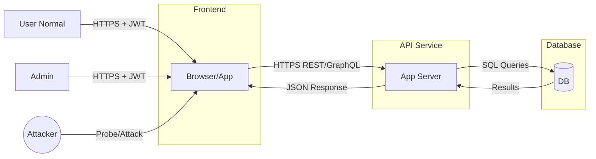

# Week 1 Report — TLS, JWT, and Threat Model

## 1. Proxy & TLS Handshake

### Proxy Setup (Day 2)
- Firefox dikonfigurasi untuk menggunakan **Burp Suite Proxy** pada `127.0.0.1:8080`.
- Burp CA Certificate di-import ke Firefox → tidak ada error SSL.
- HTTPS traffic berhasil di-intercept (contoh: `https://example.com`).
- Evidence:
  - `screenshots/day2_firefox_proxy_settings.png`
  - `screenshots/day2_firefox_ca_import.png`
  - `screenshots/day2_firefox_https_intercept.png`
  - `burp_projects/week1_burp_project_01.burp`

### TLS Handshake (Captured via Wireshark)
- **Situs diuji**: https://github.com
- **Versi TLS**: TLS 1.2 → support upgrade ke TLS 1.3
- **Cipher Suite final**: `TLS_AES_128_GCM_SHA256`
- **Sertifikat**: Valid, issuer DigiCert TLS Hybrid ECC SHA384 2020 CA1
- **Key Exchange**: ECDHE (Elliptic Curve Diffie-Hellman Ephemeral)
- **Kesimpulan**: Implementasi TLS modern, aman, dengan dukungan ALPN (HTTP/2).
- Evidence: `findings/week1/pcap/day2_tls_handshake.pcapng`

---

## 2. JWT Weakness Testing (Day 3)

### Token Variants
1. **Normal (dengan exp)** → ✅ expired sesuai 15 menit.
2. **Tanpa exp** → ❌ token valid tanpa batas waktu.
3. **alg:none** → ❌ jika diterima server → bypass signature.

### Summary Findings
- [x] No expiry → token reuse.
- [x] Alg:none exploit → bypass signature.
- [ ] Audience misuse → belum diuji.

### Recommendations
1. Wajibkan expiry (`exp`) & validasi waktu.
2. Tolak semua token dengan `alg:none`.
3. Validasi `aud` sesuai aplikasi target.

Evidence:
- `screenshots/day3_jwt_token_expired`
- `screenshots/day3_jwt_token_no_expired`
- `screenshots/day3_jwt_token_no_alg`
- `findings/week1/notes/jwt_notes.md`

---

## 3. Threat Model v1 (Day 4)

### Aktor
- **User normal** → akses data sendiri.
- **Admin** → hak kelola penuh.
- **Attacker** → pihak luar (data theft, replay, IDOR, brute force).

### Aset
- Data user (PII, transaksi)
- Token JWT (access/refresh)
- Kredensial database

### Trust Boundaries
- Frontend ↔ API ↔ Database ↔ Internet

### Ancaman & Mitigasi
1. **Sniffing tanpa TLS** → mitigasi: TLS 1.2/1.3, HSTS.
2. **Token reuse/replay** → mitigasi: short-lived token, rotation, validasi `jti`.
3. **IDOR** → mitigasi: authz per objek, UUID non-sekuensial, logging.

### Diagram Data Flow

Evidence:
- `findings/week1/notes/threat_model_v1.md`

---

## 4. Summary & Next Steps
✅ Deliverables Minggu 1:
- Burp Project + TLS PCAP evidence
- JWT weakness notes & screenshots
- Threat Model v1 (notes + diagram)
- Weekly report (file ini)

➡️ **Next Week (W2)**: OAuth2/OIDC + Postman Environment (automated token handling).
